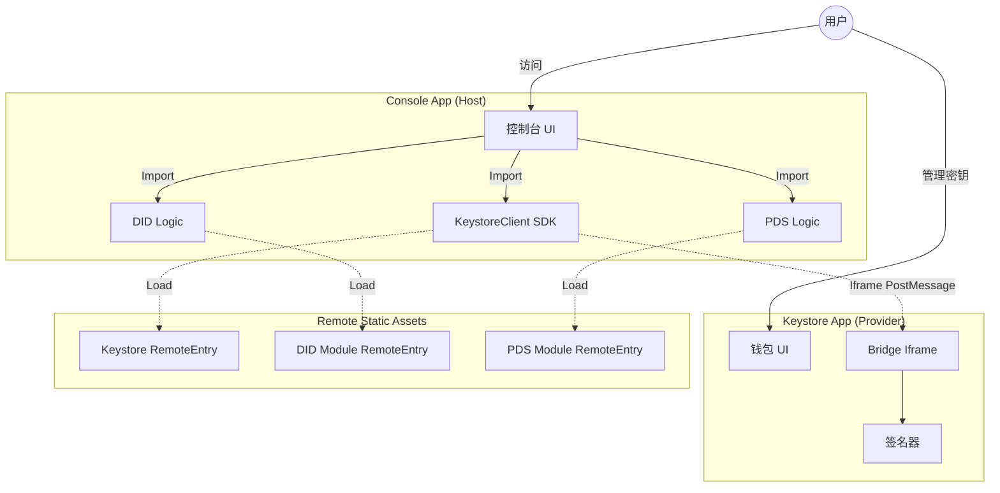

# Web5 Modules 技术架构方案

## 1. 项目概述

本项目旨在构建一套标准化的 Web5 基础模块，并通过一个 **Console 控制台应用** 演示这些模块的集成与使用。

### 核心设计理念
1.  **Keystore (Wallet Provider)**: 
    *   作为**独立应用**运行 (Standalone App)，拥有独立的 Web UI，用于管理用户私钥和签名授权。
    *   同时作为**远程模块** (Remote Module)，暴露 `KeystoreClient` SDK，供宿主应用连接和通信。
2.  **Modules (DID & PDS)**: 
    *   **无独立 UI**，作为 **远程模块 (Federated Modules)** 发布。
    *   封装了核心业务逻辑（如 CKB 交易构建、PDS 交互），供宿主应用直接调用。
3.  **Console (Host App)**: 
    *   一个标准的 Web5 业务应用 Demo。
    *   通过 Module Federation 集成上述模块，实现用户注册、登录、DID 管理和数据读写等功能。

## 2. 总体架构设计

### 2.1 架构拓扑



### 2.2 服务与端口规划

| 应用/模块 | 端口 (Local) | 类型 | 说明 |
| :--- | :--- | :--- | :--- |
| **Console** | `3000` | **Host App** | 用户入口。集成所有模块。 |
| **Keystore** | `3001` | **App & Provider** | 提供钱包界面 (Direct/Bridge) 及 Client SDK (Federation)。 |
| **DID Module**| `3002` | **Remote Provider** | 纯逻辑模块。提供 CKB DID 相关操作。 |
| **PDS Module**| `3003` | **Remote Provider** | 纯逻辑模块。提供 AT Protocol/Web5 相关操作。 |

## 3. 详细模块设计

### 3.1 Keystore (Wallet)
*   **功能**: 管理 Secp256k1 密钥，提供签名服务。
*   **Exposes (Module Federation)**:
    *   `./KeystoreClient`: 提供 `KeystoreClient` 类，封装了与 Bridge 的通信逻辑。
    *   `./constants`: 提供 `KEY_STORE_URL` 等配置常量。
*   **通信机制**:
    *   Host App 实例化 `KeystoreClient`。
    *   Client 在后台创建一个隐藏的 `iframe` 指向 `Keystore` 的 `bridge.html`。
    *   通过 `postMessage` 进行安全的跨域通信。

### 3.2 DID Module
*   **功能**: 封装 CKB 区块链交互逻辑，实现 DID 的 CRUD 操作。
*   **Exposes**:
    *   `./logic`: 核心逻辑函数。
*   **主要 API**:
    *   `buildCreateTransaction`: 构建创建 DID 的 CKB 交易。
    *   `fetchDidCkbCellsInfo`: 查询链上 DID Cell 信息。
    *   `updateDidKey`: 更新 DID 绑定的公钥。
    *   `transferDidCell`: 转移 DID 所有权。
    *   `destroyDidCell`: 销毁 DID。

### 3.3 PDS Module
*   **功能**: 封装 Web5/AtProto 协议交互逻辑，实现去中心化数据存储。
*   **Exposes**:
    *   `./logic`: 核心逻辑函数。
    *   `./constants`: 提供 `AVAILABLE_PDS` 列表。
*   **主要 API**:
    *   `pdsCreateAccount`: 在 PDS 注册新账户。
    *   `pdsLogin`: 登录 PDS 获取 Session。
    *   `writePDS`: 向用户的 PDS 写入数据记录。
    *   `fetchUserProfile`: 获取用户 Profile。

## 4. 开发指南：如何开发新的 Host App

如果您想开发一个新的应用（Host App）并复用这些模块，请遵循以下步骤：

### 4.1 配置 Module Federation
在您的 Vite 配置文件 (`vite.config.ts`) 中配置 `remotes`：

```typescript
import federation from '@originjs/vite-plugin-federation'

export default defineConfig({
  plugins: [
    federation({
      name: 'my_new_app',
      remotes: {
        // 指向各个模块的 remoteEntry.js
        keystore: 'http://localhost:3001/assets/remoteEntry.js',
        did_module: 'http://localhost:3002/assets/remoteEntry.js',
        pds_module: 'http://localhost:3003/assets/remoteEntry.js',
      },
      // 共享依赖配置
      // 必须共享: @ckb-ccc/ccc web5-api (如果 Host 和 Remote 都依赖它且传递对象)
      shared: ['@ckb-ccc/ccc', 'web5-api']
    })
  ]
})
```

> **注意**:
> 1. 在开发模式 (`npm run dev`) 下，Vite 可能无法直接加载远程生产构建的模块。建议远程模块使用 `npm run preview` 运行，或者在 Host 端配置适当的代理。
> 2. **共享依赖**: 如果您的 Host App 和 Remote Module 都使用了同一个库（如 `@ckb-ccc/ccc`），并且需要在两者之间传递由该库创建的对象，请务必将其加入 `shared` 列表，以确保单例一致性。

### 4.2 类型定义
创建 `src/remotes.d.ts` 以获得 TypeScript 类型支持：

```typescript
declare module 'keystore/KeystoreClient' {
    export class KeystoreClient {
        constructor(bridgeUrl: string);
        connect(): Promise<void>;
        signMessage(message: Uint8Array): Promise<Uint8Array>;
        // ...
    }
}

declare module 'did_module/logic' {
    export function buildCreateTransaction(...): Promise<...>;
    // ...
}

declare module 'pds_module/constants' {
    export const AVAILABLE_PDS: string[];
}

// ... 其他模块声明
```

### 4.3 集成 Keystore
使用远程提供的 `KeystoreClient` 连接钱包：

```typescript
// 从远程模块导入
import { KeystoreClient } from 'keystore/KeystoreClient';
import { KEY_STORE_BRIDGE_URL } from 'keystore/constants';

const client = new KeystoreClient(KEY_STORE_BRIDGE_URL);
await client.connect();
const didKey = await client.getDIDKey();
```

### 4.4 调用业务逻辑
直接调用远程模块的函数，就像调用本地库一样：

```typescript
import { buildCreateTransaction } from 'did_module/logic';

const {rawTx, did} = await buildCreateTransaction(signer, metadata);
```

## 5. 目录结构

```text
web5fans/
├── modules/
│   ├── apps/
│   │   ├── keystore/      # [Provider] 钱包应用 & SDK
│   │   ├── console/       # [Host] 演示应用
│   │   ├── did/           # [Remote] DID 逻辑模块
│   │   └── pds/           # [Remote] PDS 逻辑模块
│   ├── package.json       # Root config
│   └── turbo.json         # TurboRepo config
```

## 6. 运维与部署策略

### 6.1 部署架构 (Vercel/Netlify)
建议使用 Vercel 等 Monorepo 原生支持的平台。
*   **Keystore**: 部署为 `keystore.web5.fans`。必须配置 HTTPS，且作为独立 Origin 运行以保护 LocalStorage。
*   **Console**: 部署为 `console.web5.fans`。
*   **Modules**: 部署为 `did.web5.fans`, `pds.web5.fans`。

### 6.2 版本管理与兼容性
*   **滚动更新 (Rolling)**: 推荐 Remote 模块保持接口向后兼容，部署后 Host App 即时生效。
*   **Feature Preview**:
    *   利用 Vercel 的 PR Preview 功能，为 `bugfix/xxx` 分支自动生成临时域名。
    *   开发时可通过 URL 参数或环境变量，让 Host App 指向 Preview 版的 Remote URL。
